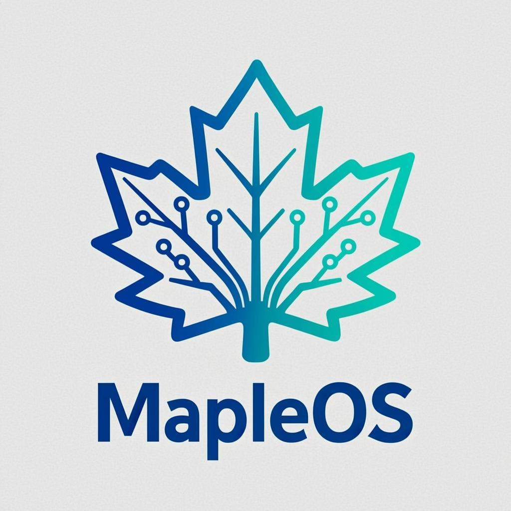

# MapleOS

<p align="center">
  
</p>

<p align="center">
  <strong>AI Native 多 Agent 协作工作站操作系统</strong>
</p>

<p align="center">
  <em>Human + Agent + Workflow + Knowledge + Tools</em>
</p>

<p align="center">
  
  
  
  
  <a href="https://scale-os.hongmaple.top/"></a>
</p>

<p align="center">
  <a href="https://repostars.dev/?repos=hongmaple0820%2Fmaple-os&theme=copper"></a>
</p>

<p align="center">
  <a href="https://scale-os.hongmaple.top/">官网</a> · <a href="./.monkeycode/docs/product-design-blueprint.md">设计蓝图</a> · <a href="./README.en.md">English</a> · <a href="#社区">社区</a> · <a href="#贡献指南">贡献指南</a>
</p>

---

## MapleOS 是什么

MapleOS 不是又一个 AI Chat，不是又一个 AI IDE，不是又一个自动化工具。

它是一个 **AI Operating System** — 面向个人与团队的新一代智能工作站：

- **多 Agent 协作中枢** — 不是单 AI，而是 AI Team
- **工作流自动化编排** — Prompt + Tools + Logic 的融合系统
- **Local-first 本地优先** — 隐私与离线能力，数据永远属于你
- **可自我进化** — 系统越用越聪明，长期资产沉淀
- **Rust Runtime** — 性能级 Agent OS，本地跑，云端跑，都能跑

> 真正实现 Human + AI Team 协同操作系统。

---

## 核心特性

| 特性 | 描述 |
|---|---|
| 工作流引擎 | DAG 调度 / 并发执行 / 事件驱动 / 状态恢复 / 失败重试 |
| 多 Agent 协作 | 注册 / 分发 / 团队编排 / 实时状态追踪 / 消息通信 |
| LLM 智能路由 | 成本 / 延迟 / 隐私 / 推理复杂度动态切换模型 |
| 知识库 | 混合检索 (BM25 + Embedding) / 自动索引 / 记忆沉淀 / 自我进化 |
| SCALE 引擎 | Spec/Plan/Task/Defect 全生命周期 / FSM 状态机 / 治理门禁 |
| Local-first 同步 | CRDT / WebDAV / 离线可运行 / 自动冲突解决 |
| 插件生态 | Skills / MCP / CLI 工具 / 浏览器控制 / 代码沙箱 |
| 安全守卫 | 工具调用拦截 / 敏感操作检测 / 角色权限 / 防暴力重试 |
| RAG 工具检索 | 向量化工具描述 / 语义搜索 / 分类标签 / 使用频率排序 |
| LLM Provider 生态 | 14+ 提供商支持 (OpenAI/Anthropic/DeepSeek/Qwen/Gemini 等) |
| 终端后端 | Local / Docker / SSH 多执行环境 / 资源限制 / 文件系统操作 |
| Cron 调度器 | 自然语言任务定义 / 定时执行 / 多种调度模式 |
| Mock 测试框架 | 确定性 Mock LLM / 请求录制 / 错误注入 / E2E 对等测试 |

---

## 技术架构

```
L1 Interface:  Web (Next.js 15) / Desktop (Tauri 2) / Mobile (React Native) / CLI
L2 Collaboration: Workspace / Permissions / Task Dispatch / Realtime Sync
L3 Orchestration: Workflow Engine / Event Bus / Agent Orchestrator / Hooks / SCALE Engine
L4 Capabilities: Skills / MCP / Browser / Code Exec / Webhooks / Plugin SDK
L5 Intelligence: LLM Router / Prompt Mgmt / Vector KB (BM25+Embedding) / Self-Evolution
L6 Storage: SQLite / PostgreSQL / Qdrant / Automerge CRDT / WebDAV
```

## 项目结构

```
mapleos/
 ├── core/               # Rust 核心引擎 (Cargo workspace)
 │   ├── maple-engine/   # 工作流引擎 + 任务队列
 │   ├── maple-llm/      # LLM 路由层 + Embedding
 │   ├── maple-agent/    # Agent 管理 + React Loop
 │   ├── maple-kb/       # 知识库 (BM25 + Vector + Memory)
 │   ├── maple-sync/     # 同步引擎 (CRDT + WebDAV)
 │   ├── maple-gateway/  # Agent 接入网关 (WS/SSE/RPC)
 │   ├── maple-collab/   # 协作层
 │   ├── maple-rpc/      # JSON-RPC 2.0 服务
 │   ├── maple-macro/    # 过程宏 (#[tool] 派生宏)
 │   └── scale-engine/   # SCALE 治理引擎 (Node.js submodule)
 ├── server/             # Rust Axum 后端服务
 ├── apps/
 │   ├── web/            # Next.js 15 Web 应用
 │   ├── desktop/        # Tauri 2 桌面客户端
 │   └── mobile/         # React Native 移动端
 ├── packages/
 │   ├── ui/             # shadcn/ui 组件库 (React)
 │   ├── sdk/            # MapleOS TypeScript SDK
 │   └── config/         # 共享配置
 ├── plugins/            # 内置插件
 ├── infra/              # Docker 部署配置
 └── .monkeycode/        # 项目文档 / 蓝图 / 记忆
```

---

## 快速开始

### 前置要求

- Rust 1.95+ (edition 2024)
- Node.js 24+ & pnpm 11+
- Ollama (可选，用于本地 LLM)

### 构建 & 运行

```bash
# 克隆项目（含 scale-engine submodule）
git clone --recurse-submodules https://github.com/hongmaple0820/maple-os.git

# Rust 后端
cargo run --release -p mapleos-server

# 安装前端依赖
pnpm install

# 前端 Web 应用
pnpm --filter=mapleos-web dev

# Tauri 桌面端（可选）
pnpm desktop:build
```

### Docker 一键部署

```bash
docker compose -f infra/docker/docker-compose.yml --profile allinone up -d
```

### LLM 路由配置

编辑 `infra/routing_rules.yaml`：

```yaml
rules:
  - name: 代码生成
    condition: "task.type == 'code_generation'"
    preferred: ["claude-3-5-sonnet", "deepseek-coder-v2"]
  - name: 隐私数据
    condition: "task.privacy_level == 'sensitive'"
    preferred: ["ollama/qwen2.5:7b"]
    fallback_to_cloud: false
```

---

## 开发文档

- [`#[tool]` 派生宏](./docs/tool-macro.md) — 声明式工具定义，自动生成 JSON Schema 和执行器
- [竞品分析](./docs/competitive-analysis.md) — 深度竞品对比与最佳实践
- [统一实施计划](./docs/unified-implementation-plan.md) — 架构升级路线图
- [v2.0.0 路线图](./docs/v2.0-roadmap.md) — v2.0.0 功能规划与实现
- [v2.1.0 实施方案](./docs/MapleOS_Implementation_Plan_2026Q3.md) — 产品闭环实施计划
- [执行事实链规范](./docs/execution-fact-chain-spec.md) — 统一执行事实链契约
- [贡献指南](./CONTRIBUTING.md) — 社区贡献指南
- [社区指南](./COMMUNITY.md) — 社区参与方式

## v2.1.0 新特性 — 产品闭环

### 统一执行事实链 (#92)
Chat / Workflow / Agent / Approval 所有执行事件写入同一 `execution_events` 表，`<ExecutionTimeline />` 组件统一渲染。

### Workflow Canvas 真编辑器 (#90)
节点 CRUD + 连线 + 8 项校验 + 版本管理 (list/get/rollback) + 失败节点 retry/skip/deadletter + 审批 UI + trace 视图。

### LLM 配置修复 (#86)
ModelDescriptor 替换 bare String，Ollama 自动发现 `/v1/models`，测试连接 endpoint，API key 脱敏显示。

### Learning 治理 (#91)
候选管线 + 质量门禁 (score≥0.7 + evidence) + blocklist 防重提 + revoke 回滚 + context preview 来源标注。

### 事件/消息触发 (#15, #16)
TriggerManager: EventTrigger (EventBus 事件匹配) + MessageTrigger (关键词/发送者/群组过滤)。

### 工具硬化 + 浏览器自动化 (#10)
http_request SSRF guard + file_ops write 审批门禁 + code_execute 权限级别 + browser 6 种 action (puppeteer + HTTP fallback)。

### 其他
- 审计日志 (#18) — DB 持久化 + API 查询
- Agent 负载均衡 (#19) — 按活跃任务数选择
- Skill Schema 校验 (#11) — JSON Schema 输入/输出验证
- Rerank 重排 (#14) — LLM-based reranker
- Automerge CRDT (#70) — 替换自定义 merge
- maple CLI (#25) — login/status/chat/workflow/trace/agents/models
- 前端模块化 (#93) — DashboardView 独立 + StatePanel 共享组件

## v2.0.0 新特性详解

### RAG-Retrievable Tools (工具向量检索)

```rust
// 注册工具时自动向量化
registry.register_with_category(tool_def, "filesystem").await?;

// 语义搜索
let tools = registry.search("read file from disk", Some(5)).await?;

// 关键词搜索 (无需 embedding)
let tools = registry.search_by_keyword("file", Some(10)).await;

// 使用频率排序
let tools = registry.search_with_usage_boost("file", Some(5)).await?;
```

### LLM Provider 生态 (14+ 提供商)

```rust
// 使用内置 provider 注册表
let registry = builtin_providers();

// 或手动创建 provider
let adapter = OpenAiCompatAdapter::deepseek(api_key);
let adapter = OpenAiCompatAdapter::qwen(api_key);
let adapter = OpenAiCompatAdapter::google(api_key, "gemini-2.0-flash");
```

### 终端后端 (多执行环境)

```rust
// 本地执行
let backend = LocalBackend::new();
let result = backend.execute("ls -la", None).await?;

// Docker 容器执行
let backend = DockerBackend::new("ubuntu:latest")
    .with_volume("/host", "/container");
let result = backend.execute("apt update", None).await?;

// SSH 远程执行
let backend = SshBackend::new("server.com", "user")
    .with_key("/path/to/key");
let result = backend.execute("uname -a", None).await?;
```

### Cron 调度器 (自然语言)

```rust
// 自然语言解析
let schedule = CronExpression::parse_natural_language("every 5 minutes")?;
let schedule = CronExpression::parse_natural_language("daily at 9:00")?;
let schedule = CronExpression::parse_natural_language("weekly on Monday at 14:00")?;
```

### Mock 测试框架

```rust
// 创建 mock adapter
let mut adapter = MockLlmAdapter::new("test-model");
adapter.when(
    RequestMatcher::ContentContains("hello"),
    MockResponses::text("Hi there!"),
);

// E2E 对等测试
let mut harness = MockParityHarness::new("test-model");
harness.add_test_case(ParityTestCase { ... });
let report = harness.verify_parity().await?;
```

---

## 产品设计蓝图

完整的「产品 + 设计 + 工程」统一蓝图见 [.monkeycode/docs/product-design-blueprint.md](./.monkeycode/docs/product-design-blueprint.md)，涵盖：

- Figma 设计体系（色彩 / 字体 / 组件 / Tokens）
- 核心产品模块（Dashboard / Workflow Editor / Agent Center / Knowledge）
- 技术架构设计（Rust Runtime / LLM Router / CRDT Sync / Plugin SDK）
- 开发阶段规划（Phase 1-3 Roadmap）
- Developer Handoff 规范

---

## 开发路线图

### v2.0.0 — 生产级 Agent OS (已完成)

**P0 — 核心竞争力:**
- [x] RAG-Retrievable Tools — 向量化工具描述 + 语义搜索 + 分类标签 + 使用频率排序
- [x] LLM Provider 生态扩展 — 14+ 提供商 (OpenAI/Anthropic/DeepSeek/Qwen/Gemini/Mistral/Groq/Moonshot/Yi/Baichuan/Minimax/Stepfun)

**P1 — 生产就绪:**
- [x] Cron 调度器 + 自然语言任务 — "every 5 minutes", "daily at 9:00", "weekly on Monday at 14:00"
- [x] 终端后端扩展 — Local / Docker / SSH 多执行环境

**P2 — 工程质量:**
- [x] Mock Parity Harness — 确定性 Mock LLM + E2E 对等测试框架
- [x] ToolSearch 运行时发现 — 关键词工具搜索，无需 embedding

### Phase 1 — 基础引擎

- Rust 核心引擎: Workflow / Agent / LLM Router / Knowledge / Task Queue
- Web 前端: Dashboard / Chat / Workflow Editor / Agent Center
- SCALE Engine 治理集成
- SQLite + BM25 + Vector 混合检索

### Phase 2 — 协作进化

- Agent 多面板协作 / 团队编排
- 知识自我进化 / 记忆沉淀
- Workflow 可视化 Canvas 编辑器
- WebDAV / Automerge CRDT 同步
- Tauri 2 桌面客户端

### Phase 3 — 生态平台

- 插件市场 / MCP 开放注册
- 企业版功能 / 团队管理 / 多租户
- Agent 市场 / SaaS 平台
- 私有部署方案

---

## 为什么要开源共建

MapleOS 的核心信念是：**AI 工作站应该是开放的、可积累的、属于每个开发者自己的。**

我们选择开源，因为：

1. **透明信任** — Agent 系统直接影响你的工作流，你需要看清它在做什么
2. **Local-first** — 数据和隐私主权属于用户，开源是实现这一点的唯一方式
3. **生态共建** — Skills / MCP / 插件需要社区共创，一个人做不了所有工具
4. **长期沉淀** — 知识和记忆的积累需要稳定的、不受商业周期影响的载体

> 如果你相信 AI 应该是工作站的操作系统，而不是聊天框的附庸，欢迎加入我们。

---

## 贡献指南

我们欢迎所有形式的贡献！

### 新手入门

1. Fork & Clone 项目
2. 选择一个 [Good First Issue](https://github.com/hongmaple0820/maple-os/issues?q=is%3Aissue+is%3Aopen+label%3A%22good+first+issue%22)
3. 提交 PR，我们在 24 小时内 Review

### 贡献方向

| 方向 | 技能要求 | 示例 |
|---|---|---|
| Rust 核心引擎 | Rust / Tokio / Axum / SQLite | 工作流节点类型、Agent 协议、任务队列 |
| Web 前端 | React / Next.js / Tailwind | 新页面、组件优化、交互细节 |
| TypeScript SDK | TypeScript / JSON-RPC | SDK 接口、类型定义、测试 |
| SCALE Engine | Node.js / TypeScript / MCP | 新检测器、工作流预设、知识模块 |
| 插件开发 | 任意语言 / MCP 协议 | web_search、PDF 处理、浏览器控制 |
| 文档 & 设计 | Markdown / Figma | API 文档、设计规范、教程 |
| 测试 & CI | Vitest / Playwright / GitHub Actions | 单元测试、集成测试、E2E |

### 提交规范

```
feat: 新功能
fix: 修复 bug
refactor: 重构
docs: 文档
chore: 构建/CI/依赖
```

### 开发流程

```bash
# 1. 创建分支
git checkout -b feat/your-feature

# 2. 开发 & 测试
cargo test && pnpm build

# 3. 提交 PR
git push origin feat/your-feature
# 在 GitHub 上创建 Pull Request
```

---

## 社区

<p align="center">
  <strong>加入 MapleOS 开源社区，一起构建 AI 工作站的未来</strong>
</p>

| 渠道 | 地址 | 说明 |
|---|---|---|
| 官网 | [scale-os.hongmaple.top](https://scale-os.hongmaple.top/) | 产品介绍、在线 Demo |
| QQ 群 | **628043364** | 开发者交流群，技术讨论、问题反馈 |
| 微信公众号 | **鸿枫技术栈** | 技术分享、版本公告、社区活动 |
| 微信号 | **mapleCx330** | 交流群入口，加好友拉入开发者群 |
| 飞书群 | 扫码加入 | 企业协作、深度技术交流 |
| 邮箱 | [2496155694@qq.com](mailto:2496155694@qq.com) | Bug 反馈、合作咨询、安全问题 |
| GitHub Issues | [maple-os/issues](https://github.com/hongmaple0820/maple-os/issues) | Bug 报告、功能建议、技术讨论 |
| GitHub Discussions | [maple-os/discussions](https://github.com/hongmaple0820/maple-os/discussions) | 开放讨论、问答、想法碰撞 |
| SCALE Engine | [scale-engine](https://github.com/hongmaple0820/scale-engine) | AI Agent 治理引擎（核心依赖） |

> 扫码关注微信公众号，获取最新版本公告和技术深度文章。开发者群内有核心作者实时答疑。

<p align="center">
  
  <br>
  <strong>关注微信公众号</strong>
</p>

<p align="center">
  
  
  <br>
  <strong>微信交流群</strong> &nbsp;&nbsp;&nbsp; <strong>飞书交流群</strong>
</p>

---

## 赞赏支持

如果 MapleOS 对你有帮助，欢迎请作者喝杯咖啡 ☕

<p align="center">
  
  
  <br>
  <strong>微信赞赏</strong> &nbsp;&nbsp;&nbsp; <strong>支付宝赞赏</strong>
</p>

---

## 技术栈一览

| Layer | Tech | 选择理由 |
|---|---|---|
| Desktop | Tauri 2 | 跨平台原生桌面，Rust 后端 |
| Web | Next.js 15 | App Router + SSE + 反向代理 |
| Backend | Rust Axum | 高性能、低延迟、安全 |
| Runtime | Tokio | 异步运行时 |
| Workflow | Petgraph | DAG 调度 |
| Database | SQLite | Local-first 零依赖 |
| Vector DB | Qdrant (可选) | 高性能向量检索 |
| Sync | Automerge CRDT | 离线同步、冲突自动解决 |
| AI Runtime | Ollama | 本地 LLM 隐私推理 |
| Governance | SCALE Engine | Agent 治理 + FSM + 门禁 |

---

## 性能基准

| 组件 | 操作 | 时间 |
|------|------|------|
| Trident Compaction | 20 消息 | 22.5 µs |
| Trident Compaction | 100 消息 | 112.4 µs |
| Skill Discovery | 100 技能 | 44.2 µs |
| Credential Stripping | 大 JSON | 216.9 µs |
| Workflow DAG | 验证 (中等) | 13.5 µs |
| Parallel Tools | 10 并发 | 24.8 µs |
| Lane Manager | 完整生命周期 | 57.0 µs |
| Trajectory Scoring | 评分 | 23.8 ns |
| Platform Registry | 路由消息 | 994.6 ns |
| Tool Sync | 更新 | 16.2 µs |

## 产品护城河

1. **自我进化** — 系统越用越聪明，记忆 + 规则 + 行为追踪 + Lesson 沉淀
2. **多 Agent 协作** — 不是单 AI，而是 AI Team 协同操作系统
3. **Local-first** — 隐私主权、离线能力、数据永远属于用户
4. **Rust Runtime** — 性能级 Agent OS，不是玩具
5. **Workflow + Knowledge** — 长期资产沉淀，不是临时对话

---

## 致谢

- [SCALE Engine](https://github.com/hongmaple0820/scale-engine) — AI Agent 治理引擎
- [shadcn/ui](https://ui.shadcn.com/) — React 组件库设计体系
- [Vercel AI Chatbot](https://github.com/vercel/ai-chatbot) — Chat UI 参考架构
- [Linear](https://linear.app/) / [Raycast](https://raycast.com/) — 产品视觉风格参考
- [Automerge](https://automerge.org/) — CRDT 同步引擎
- [Qdrant](https://qdrant.tech/) — 向量数据库
- [Tauri](https://tauri.app/) — 桌面应用框架

---

## License

MIT — 自由使用、修改、分发。我们相信 AI 工作站应该是开放的。
